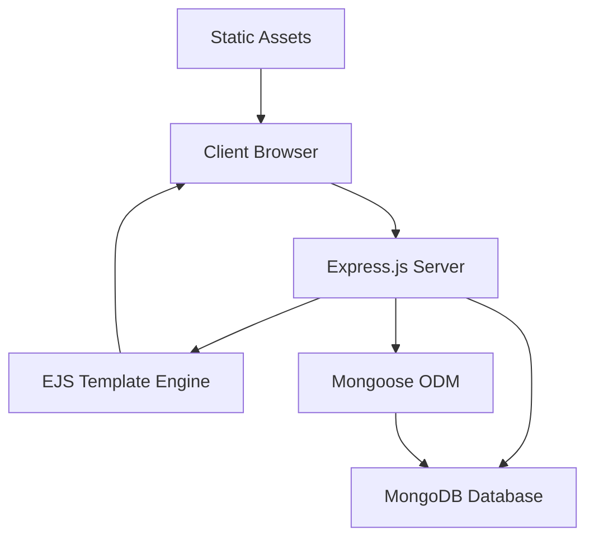

<div align="center">
  
</div>

<div align="center">
  
  
  
  
</div>

<div align="center">
  
  
  
  
  
</div>

<div align="center">
  
  
  
  
</div>

<div align="center">
  <h3>🚀 Deployed On</h3>

[](https://todo-list-v2-xelq.onrender.com)

</div>

<br>

---

## 📋 Table of Contents

- [🎯 Overview](#-overview)
- [✨ Features](#-features)
- [🏗️ Architecture](#️-architecture)
- [🛠️ Tech Stack](#️-tech-stack)
- [📁 Project Structure](#-project-structure)
- [🚀 Quick Start](#-quick-start)
- [📊 API Documentation](#-api-documentation)
- [🔧 Configuration](#-configuration)
- [🧪 Testing](#-testing)
- [📄 License](#-license)
- [👥 Author](#-author)

---

## 🎯 Overview

**Todo List V2** is a modern, full-stack task management application built with the **MEAN** stack principles. It provides a seamless user experience for managing daily tasks with **real-time CRUD operations**, **persistent data storage**, and a **responsive dark-themed interface**.

<div align="center">
  
  
  
</div>

### 🎯 Key Highlights

- **🔄 Real-time Updates**: Instant task synchronization
- **💾 Persistent Storage**: MongoDB-powered data persistence
- **📱 Responsive Design**: Mobile-first approach
- **🎨 Modern UI/UX**: Clean, intuitive interface
- **⚡ Fast Performance**: Optimized for speed
- **🔒 Secure**: Input validation and sanitization

---

## ✨ Features

<table>
  <tr>
    <td align="center"></td>
    <td><strong>Create Tasks</strong><br>Add new tasks with intuitive form interface</td>
  </tr>
  <tr>
    <td align="center"></td>
    <td><strong>View Tasks</strong><br>Display all tasks in organized, scrollable list</td>
  </tr>
  <tr>
    <td align="center"></td>
    <td><strong>Edit Tasks</strong><br>Inline editing with real-time updates</td>
  </tr>
  <tr>
    <td align="center"></td>
    <td><strong>Delete Tasks</strong><br>One-click task removal with confirmation</td>
  </tr>
  <tr>
    <td align="center"></td>
    <td><strong>Data Persistence</strong><br>MongoDB integration for reliable storage</td>
  </tr>
  <tr>
    <td align="center"></td>
    <td><strong>Responsive Design</strong><br>Seamless experience across all devices</td>
  </tr>
</table>

---

## 🏗️ Architecture

<div align="center">
  
  
  
</div>



---

## 🛠️ Tech Stack

### **Backend Technologies**
| Technology | Version | Purpose | Documentation |
|------------|---------|---------|---------------|
|  | 18.x+ | Runtime Environment | [📚 Docs](https://nodejs.org/docs/) |
|  | 5.1.0 | Web Framework | [📚 Docs](https://expressjs.com/) |
|  | 7.0+ | Database | [📚 Docs](https://docs.mongodb.com/) |
|  | 8.16.3 | ODM Library | [📚 Docs](https://mongoosejs.com/) |

### **Frontend Technologies**
| Technology | Version | Purpose | Documentation |
|------------|---------|---------|---------------|
|  | 3.1.10 | Template Engine | [📚 Docs](https://ejs.co/) |
|  | Latest | Markup Language | [📚 Docs](https://developer.mozilla.org/en-US/docs/Web/HTML) |
|  | Latest | Styling | [📚 Docs](https://developer.mozilla.org/en-US/docs/Web/CSS) |
|  | ES6+ | Client-side Logic | [📚 Docs](https://developer.mozilla.org/en-US/docs/Web/JavaScript) |

### **Development Tools**
| Tool | Purpose |
|------|---------|
|  | Version Control |
|  | Code Repository |
|  | IDE |
|  | Package Manager |

---

## 📁 Project Structure

```
📦 todolistv2/
├── 📄 app.js                  # Main application entry point
├── 📄 package.json           # Project dependencies & scripts
├── 📄 package-lock.json      # Locked dependency versions
├── 📄 README.md             # Project documentation
├── 📄 .gitignore            # Git ignore rules
├── 📁 public/               # Static assets
│   └── 🎨 style.css         # Application stylesheet
├── 📁 views/                # EJS templates
    └── 📄 index.ejs         # Main application 
```

---

## 🚀 Quick Start

### 📋 Prerequisites

<div align="center">
  
  
  
</div>

### 🔧 Installation

1. **Clone the repository**
   ```bash
   git clone https://github.com/Rabi22/Todo-List-V2.git
   cd Todo-List-V2
   ```

2. **Install dependencies**
   ```bash
   npm install
   ```

3. **Environment Setup**
   ```bash
   # Create .env file
   cp .env.example .env
   
   # Configure your environment variables
   MONGODB_URI=mongodb://localhost:27017/todoV2
   PORT=3000
   NODE_ENV=development
   ```

4. **Start MongoDB**
   ```bash
   # Using MongoDB Community Server
   mongod
   
   # Or using Docker
   docker run -d -p 27017:27017 --name mongodb mongo:latest
   ```

5. **Run the application**
   ```bash
   # Development mode
   npm run dev
   
   # Production mode
   npm start
   ```

6. **Access the application**
   ```
   🌐 Local: http://localhost:3000
   ```

---

## 📊 API Documentation

### **Endpoints Overview**

<div align="center">
  
  
  
</div>

| Method | Endpoint | Description | Request Body | Response |
|--------|----------|-------------|--------------|----------|
| 🟢 **GET** | `/` | Retrieve all tasks | None | HTML Page |
| 🟡 **POST** | `/` | Create new task | `{ todo_input: string }` | Redirect to `/` |
| 🔵 **PUT** | `/task/:id` | Update existing task | `{ edit_item: string }` | Redirect to `/` |
| 🔴 **DELETE** | `/task/:id` | Delete task | None | Redirect to `/` |

### **Request/Response Examples**

#### Create Task
```http
POST /
Content-Type: application/x-www-form-urlencoded

todo_input=Complete project documentation
```

#### Update Task
```http
PUT /task/64f8b12c8d5e1234567890ab
Content-Type: application/x-www-form-urlencoded

edit_item=Review project documentation
```

#### Delete Task
```http
DELETE /task/64f8b12c8d5e1234567890ab
```

---

## 🔧 Configuration

### **Environment Variables**

```env
# Application Settings
PORT=3000
NODE_ENV=development

# Database Configuration
MONGODB_URI=mongodb://localhost:27017/todoV2
DB_NAME=todoV2


```

### **Database Schema**

```javascript
// Todo Schema
    {
        type : String,
        required: true
    }
```


---

## 🧪 Testing

### **Testing Framework**

<div align="center">
  
  
</div>

```bash
# Run all tests
npm test

# Run tests with coverage
npm run test:coverage

# Run tests in watch mode
npm run test:watch
```

### **Test Coverage**

```bash
# Generate coverage report
npm run coverage

# View coverage report
open coverage/lcov-report/index.html
```


---

## 📄 License

<div align="center">
  
</div>

This project is licensed under the **ISC License** - see the [LICENSE](LICENSE) file for details.

```
ISC License

Copyright (c) 2024 Rabi

Permission to use, copy, modify, and/or distribute this software for any
purpose with or without fee is hereby granted, provided that the above
copyright notice and this permission notice appear in all copies.
```

---

## 👥 Author

<div align="center">
  
  <br>
  <strong>Rabi</strong>
  <br>
  <em>Mechanical Engineer | Computer Science Student</em>
</div>

<div align="center">
  <a href="https://github.com/Rabi22">
    
  </a>
  <a href="mailto:rabi@example.com">
    
  </a>
  <a href="https://linkedin.com/in/rabi22">
    
  </a>
</div>

---

## 📞 Support

<div align="center">
  
</div>

- 📧 **Email**: [rabipradhan320@gmail.com](mailto:rabipradhan320@gmail.com)
- 🎓 **Academic Purpose**: Personal learning project for skill development

---

## 🎯 Roadmap

- [ ] **User Authentication** - Add login/register functionality
- [ ] **Task Categories** - Organize tasks by categories
- [ ] **Due Dates** - Set deadlines for tasks
- [ ] **Priority Levels** - Add task priority system
- [ ] **Dark/Light Mode** - Theme switching capability
- [ ] **Search & Filter** - Advanced task filtering
- [ ] **Data Export** - Export tasks to CSV/JSON
- [ ] **Mobile Responsive** - Enhanced mobile experience

---

## 🎓 Learning Outcomes

This project demonstrates proficiency in:

- **Full-stack development** with Node.js and Express.js
- **Database design** and integration with MongoDB
- **RESTful API** development and implementation
- **Template engines** and server-side rendering
- **CRUD operations** and data persistence
- **Modern web development** practices and patterns
- **Version control** with Git and GitHub
- **Project documentation** and presentation skills

---
